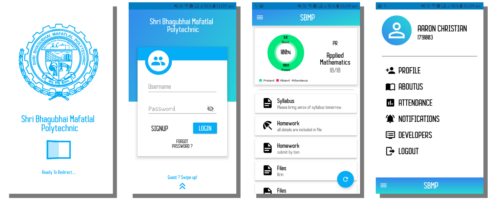
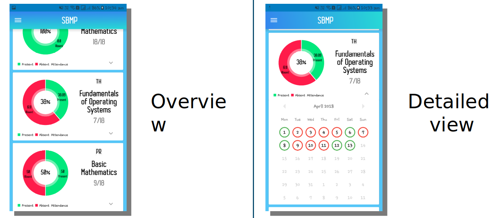
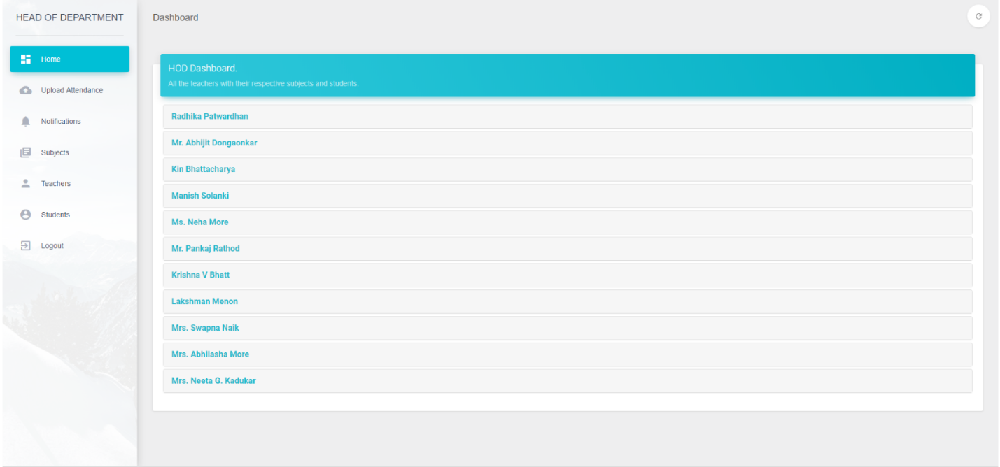

# Project Seito
> College Management Project for SBMP

## Features

- **Attendance Management** :- This feature aims to provide attendance data to students within the app and managing each student’s attendance data to faculty members by providing a web interface.  
- **Notifications Management** : This feature aims to provide notification services to the students and faculty members in android application. The notifications can be curricular, extra- curricular, exam schedule and results. 
- **Data Management System** : This feature aims to provide the facility to add new subjects, add new teachers, changing the access rights, registering students to subjects and allowing Administrator to backup and clear all the data after every semester.
- **Contact us support** : This feature aims to provide access to all the users who are not a member of the college, such as guest users. They can view the college website from the app for additional information and support.
- **Reference Links** :- This feature aims to provide educational reference links to the students of the college. The links can be accessed directly from the app and students can read and access the information through their android devices.
- **PDF Files** : This feature aims to provide curriculum related data in terms of any document to the students as well as to the faculty members. The users of the app can directly access the file from their mobile devices.
- **Administrative Management Interface** :-This feature aims to provide Administrative management support for the data. This feature is the root of whole architecture which will provide Administrator to monitor, manage and modify information and rights of the application. 
- **Monitoring**: Attendance data uploaded by the teachers
- **Modify**:
    - Department specific details 
    - Sent and Stored Notifications
    - Access rights for HOD’s and Teachers
    - Semester data such as Adding new Subjects

## Technology Used
- **Backend**
    - Node.js
    - Express.js
    - Nginx
    - Firebase 
    - Mysql
- **Frontend**
    - App : Android
    - Web : Bootstrap,Material Design

## Contributors

- Nishay Madhani  – nshmadhani@gmail.com [https://github.com/nshamdhani](https://github.com/nshmadhani/)
- Yash Mehta -  mehta.yash919@gmail.com [https://github.com/ykm17](https://github.com/ykm17)
- Bhavin Mehta - mehta.bhavinm@gmail.com [https://github.com/mehtabhavin10](https://github.com/mehtabhavin10)

